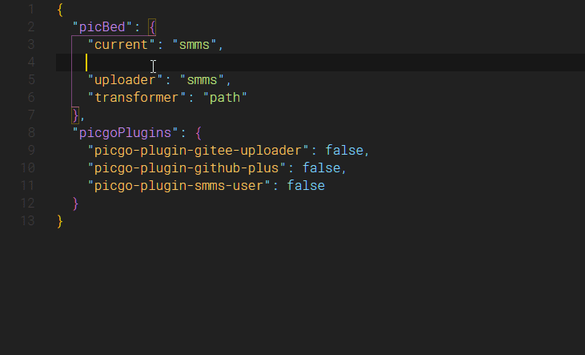

# Picgo Profile Schema

[中文](README.md)

[](https://marketplace.visualstudio.com/items?itemName=alexzshl.picgo-profile-schema)

This extension provides schema for profile of picgo:
- [PicGo-Core](https://picgo.github.io/PicGo-Core-Doc/)
- [Picgo-electron](https://picgo.github.io/PicGo-Doc/)

You can add the schema file reference to config.json (picgo-core), then you don't need to install this vscode extension.
```json
{
  "$schema": "https://gitee.com/alexzshl/vscode-picgo-profile-schema/raw/master/schemas/picgo-core.profile.schema.json",
  
  "picbed": {}
}
```

## Features

Picgo-electron users can have gui interface for configuration, but PicGo-Core users can only use the cli tool. With all due respect, it's not a good experience to configure dozens of settings with cli. So I wrote this extension to provide json schema foundation for picgo profile.

**JSON Schema** provides data validation, more importantly, we can get smart tips after opening picgo profile with VSCode.



### Profile Path

PicGo-Core and Picgo-electron has different defalt profile path.

##### PicGo-Core

- **Windows**: `C:/Users/[user-name]/.picgo/config.json`
- **Linux**: `~/.picgo/config.json`
- **MacOS**: `~/.picgo/config.json`

##### Picgo-electron

- Windows: `C:/Users/[user-name]/AppData/Roaming/picgo/data.json`
- Linux: `$XDG_CONFIG_HOME/picgo/data.json` or `~/.config/picgo/data.json`
- macOS: `~/Library/Application/Support/picgo/data.json`

## Requirements

## Known Issues

## Contribution

## About
[JSON Schema](http://json-schema.org/)
-----------------------------------------------------------------------------------------------------------
