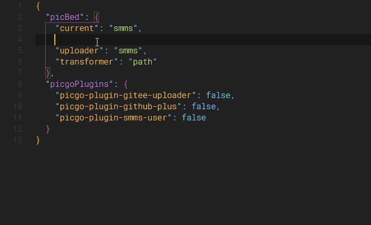

# Picgo Profile Schema

This extension provides schemas for profile of picgo:
- [Picgo-Core](https://picgo.github.io/PicGo-Core-Doc/)
- [PicGo-GUI](https://picgo.github.io/PicGo-Doc/)

## Features

PicGo-GUI users can have gui interface for configuration, but Picgo-Core users can only use the cli tool. With all due respect, it's not a good experience to configure dozens of settings with cli. So I wrote this extension to provide json schema foundation for picgo profile.

**JSON Schema** provides data validation, more importantly, we can get smart tips after opening picgo profile with VSCode.

### profile path

Picgo-Core and PicGo-Gui has different defalt profile path.

#### Picgo-Core

- **Windows**: `C:/Users/[user-name]/.picgo/config.json`
- **Linux**: `~/.picgo/config.json`
- **MacOS**: `~/.picgo/config.json`

#### PicGo-GUI

- Windows: `C:/Users/[user-name]/AppData/Roaming/picgo/data.json`
- Linux: `$XDG_CONFIG_HOME/picgo/data.json` or `~/.config/picgo/data.json`
- macOS: `~/Library/Application/Support/picgo/data.json`

## Requirements

## Extension Settings

## Known Issues

## Release Notes

Users appreciate release notes as you update your extension.

### 0.0.1

Initial release

## Contribution

The Schema file is still to be perfected, especially in the descriptions (mouse-over prompt) section. Please help refine and promote its standardization.

1. A little knowledge of [JSON Schema](http://json-schema.org/).
2. Edit docs in `./schemas`.

-----------------------------------------------------------------------------------------------------------
