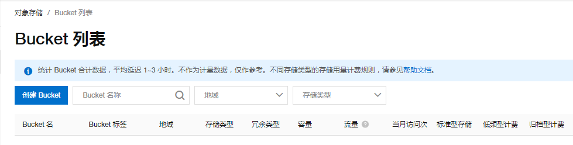

## 简介
阿里云OSS对象存储, 收费服务, 但是可以按流量收费, 对于个人使用而言, 花费几乎可以忽略
阿里云OSS不止可以做图床, 还可以做网盘, 做静态站点等

## 使用简介
首先需要注册一个阿里云帐户
然后进入OSS控制台: https://oss.console.aliyun.com/overview

### 创建 bucket
右侧点击创建bucket, 需要注意的地方:
- bucket名称: 对应配置文件中的 `bucket`
- 地域: 根据情况自己选择, 影响下面的 `endpoint`, 对应配置文件中的 `area`. 例如: `endpoint` 为 `oss-cn-hangzhou.aliyuncs.com`, 则 `area` 为 `oss-cn-hangzhou`
- 存储类型: `低频访问存储`或者`标准存储`
- 读写权限: `公共读`

创建完成后, 在浏览器的url中也可以快速获取到 `bucket` 和 `area` 信息:

点击左侧文件管理, 根据需要可选择创建一个文件夹用于存放图片(对应于配置文件中的 `path`). 如果不配置, 则会上传至根目录

### 创建用户
一般建议使用子用户来操作数据, 已经创建过子用户的可跳过
用户管理地址是: https://ram.console.aliyun.com/users
创建时注意勾选`编程控制`, 注意下载那个csv文件(可以保存在支持文件上传的密码管理器中)
配置文件中的 `accessKeyId` 和 `accessKeySecret` 来自于此

### bucket 授权
文件管理-授权, 授权给子用户, 权限至少为 `读/写`

## 配置
根据以上信息, 修改配置文件, 最后测试上传是否正常

